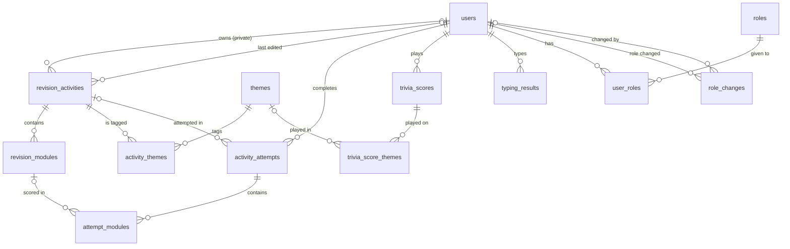
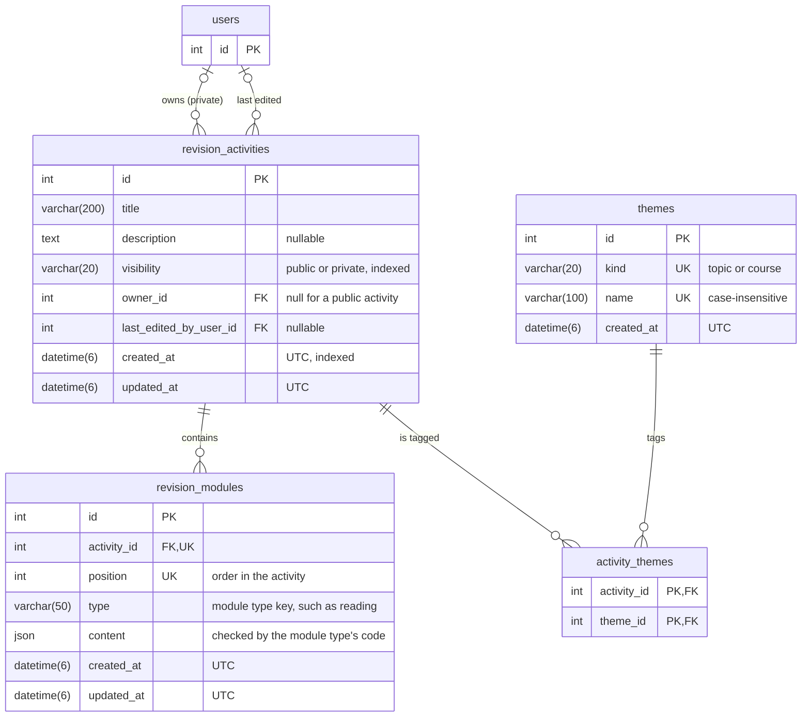
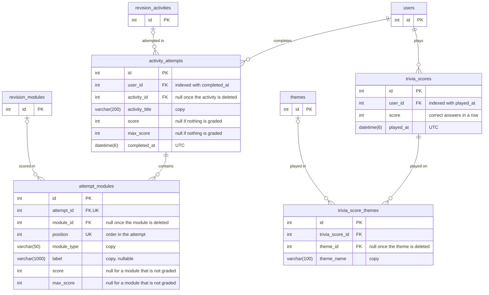
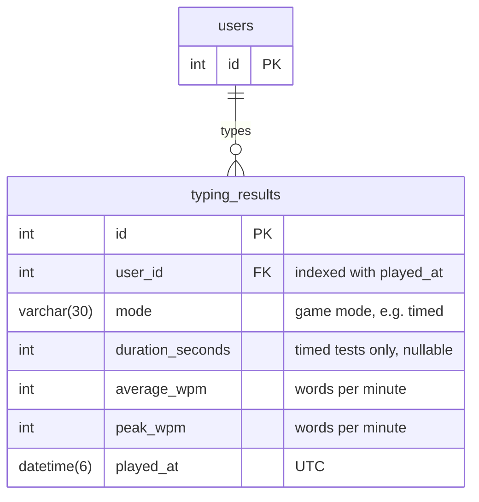
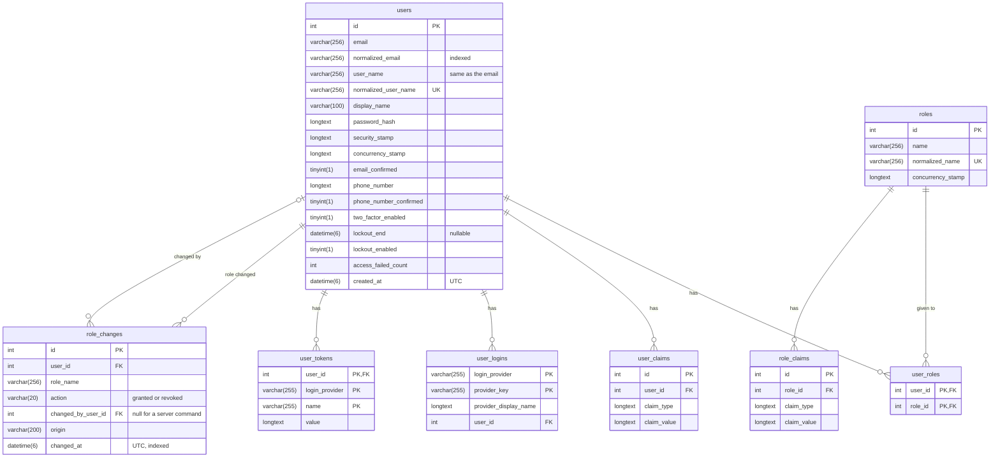

# Database schema

The MySQL tables and their relations, as entity-relationship diagrams in
crow's foot notation. GitHub renders the Mermaid diagrams; in VS Code,
use a Markdown preview extension that supports Mermaid.

The schema only changes through EF Core migrations
(`backend/src/RevisionPlatform.Api/Data/Migrations`). **Update this page
in the same change as every migration** that adds, removes or changes a
table, a column, a key or a relation. The design choices behind the
tables are explained in [architecture.md](architecture.md#database).

How to read the diagrams:

| Symbol | Meaning                 |
|--------|-------------------------|
| `PK`   | Primary key             |
| `FK`   | Foreign key             |
| `UK`   | Unique (alone or with the other `UK` columns of the table) |
| `\|\|` | Exactly one             |
| `o\|`  | Zero or one (nullable foreign key) |
| `o{`   | Zero or many            |

Tables and columns use `snake_case`. Ids are auto-increment `int`s.
`__EFMigrationsHistory` (managed by EF Core: the migrations already
applied) is not shown.

## Overview

## Activities and themes

- **Check constraint** `ck_revision_activities_visibility_owner`: a
  public activity has no owner, a private activity has one.
- A course is a theme whose `kind` is `course`; the others are `topic`.
- `themes.name` uses the `utf8mb4_0900_as_ci` collation:
  case-insensitive, accent-sensitive.

## Results and trivia scores

Results keep copies of what they show (`activity_title`, `label`,
`theme_name`), so their links can become null when an activity, a module
or a theme is deleted.

## Typing test results

The typing test is independent of the activities: its results are only
linked to the user.

## Accounts and roles

The tables of ASP.NET Core Identity, plus `role_changes`, the audit
trail of the roles. `user_claims`, `user_logins`, `user_tokens` and
`role_claims` are created by Identity but not used yet.

## What happens on delete

| Deleted row          | Effect on the rows that reference it |
|----------------------|--------------------------------------|
| `revision_activities` | Its `revision_modules` and `activity_themes` are deleted; `activity_attempts.activity_id` becomes null. |
| `revision_modules`   | `attempt_modules.module_id` becomes null. |
| `themes`             | Its `activity_themes` are deleted; `trivia_score_themes.theme_id` becomes null. |
| `activity_attempts`  | Its `attempt_modules` are deleted. |
| `trivia_scores`      | Its `trivia_score_themes` are deleted. |
| `users`              | Their private activities, attempts, trivia scores, typing results, roles, claims, logins and tokens are deleted; `revision_activities.last_edited_by_user_id` becomes null. **Refused** while `role_changes` references the user. |
| `roles`              | Its `user_roles` and `role_claims` are deleted. |
